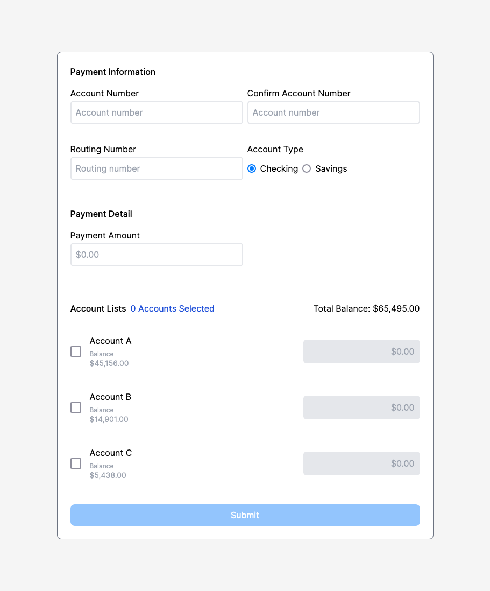
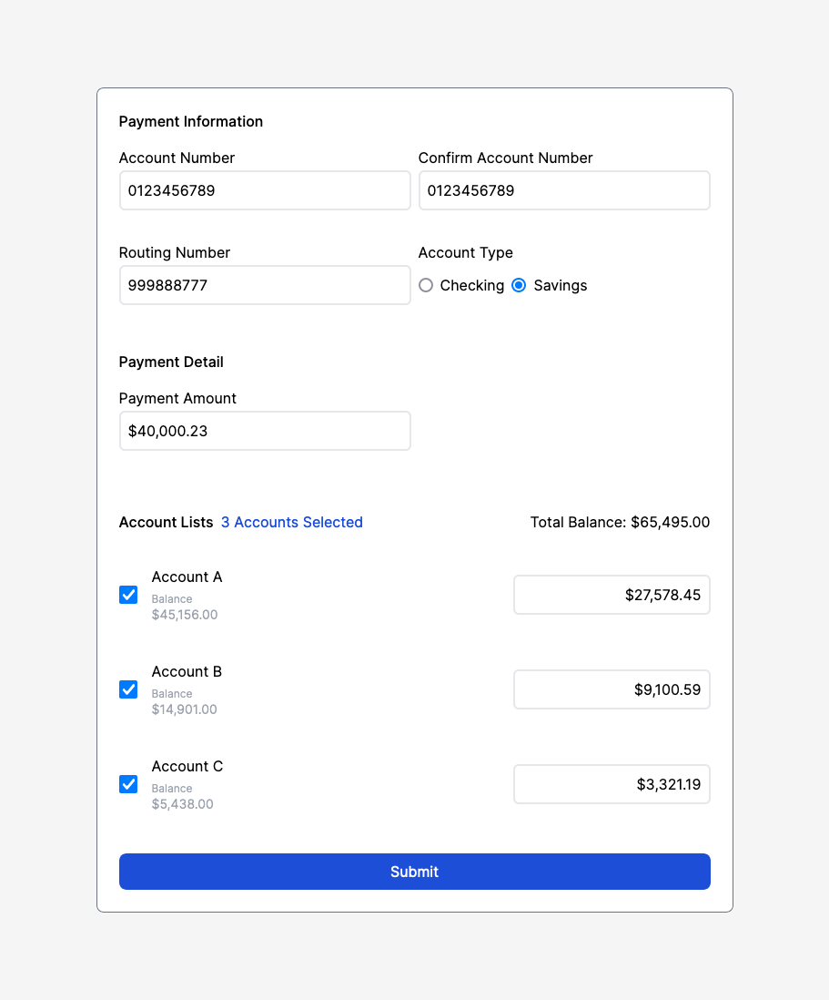
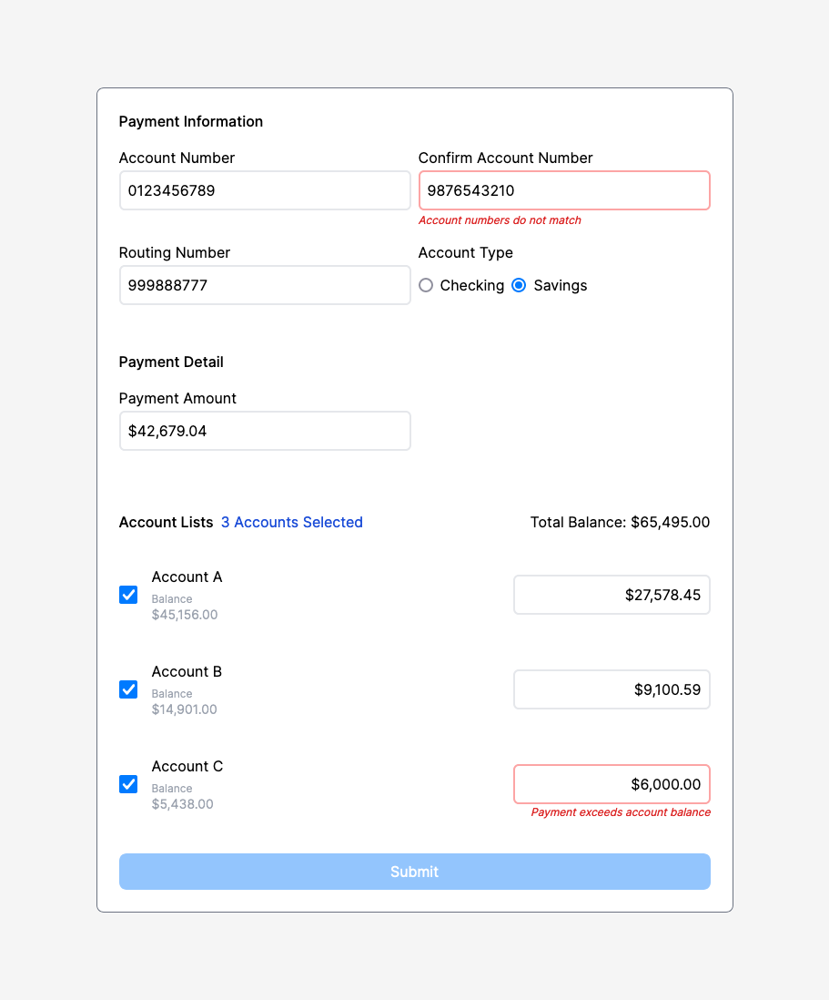
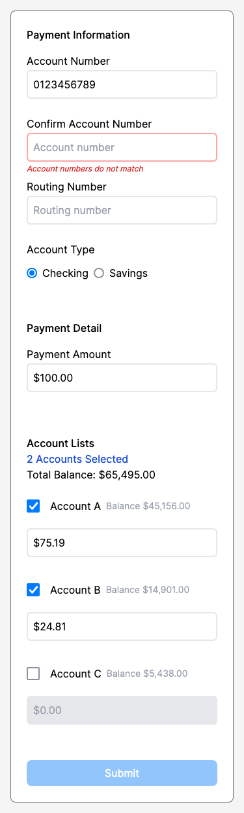

# Payment Form
A payment form component created with NextJS, TypeScript, and Tailwind. All components are made entirely from scratch.
This was completed for Clerkie's frontend coding challenge. 

You can demo this form using this [link](https://clerkie-fe-challenge.vercel.app/)!

## How It Looks

*Empty Form*



*Filled Out Form*



*Form with Errors*



*Mobile View*



## Getting Started

First, run the development server:

```bash
npm run dev
# or
yarn dev
# or
pnpm dev
# or
bun dev
```

## Coding Challenge Instructions
In this task, you'll experience a condensed version of a real problem we've tackled at Clerkie. It's designed to simulate a day in the life of our engineering team, giving you a taste of the practical challenges and scenarios you might encounter working with us.

At Clerkie Engineering, we value team members who:
  - Demonstrate strong independent problem solving skills, while also recognizing when to ask for help.
  - Deliver well written, thoroughly tested code, even under tight deadlines.
  - Have a passion for product development, combining exceptional engineering skills with a dedication to producing pixel-perfect layouts.

Your challenge is to build a simple payment form, enabling users to manage payments towards various accounts.

Here are your task requirements:
  - When a user updates the payment amount input or selects an account, individual account inputs should update with a prorated amount. This calculation will depend on the original balance of the account, other selected accounts, and the payment amount entered.
  - The total payment by a user should not exceed the cumulative balance of the selected accounts.
  - Users must not be able to pay more than the original balance of any single account.
  - At least one account must be selected for payment.

Watch out for the following:
  - Accurately handle rounding errors, especially with large numbers.
  - Ensure thorough validation of all input fields.
  - The form should be non-submittable if it's in an invalid state.

Additional Notes:
  - While you may use libraries for logic where necessary, we're eager to see your individual problem solving skills in action.
  - Frameworks like Tailwind are acceptable for styling. However, please avoid using comprehensive component frameworks.
  - Some details are intentionally left open ended. We're interested in your understanding of UX and adherence to industry best practices.

Good luck, and we look forward to seeing your submission!
